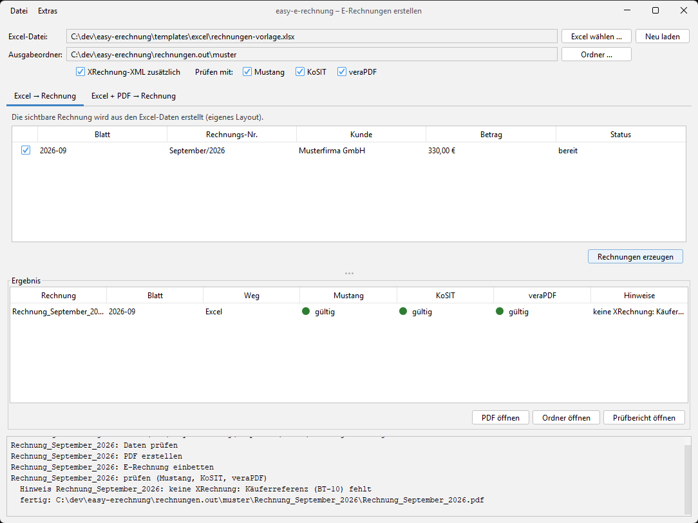

# 🧾 easy-e-rechnung

[](https://github.com/jaui/easy-erechnung/actions/workflows/build.yml)
[](https://github.com/jaui/easy-erechnung/releases)
[](https://github.com/jaui/easy-erechnung/releases)
[](LICENSE)
[](#-setup)
[](https://github.com/jaui/easy-erechnung/actions/workflows/build.yml)
[](https://ec.europa.eu/digital-building-blocks/sites/display/DIGITAL/Obtaining+a+copy+of+the+European+standard+on+eInvoicing)
[](https://www.ferd-net.de/)
[](https://xeinkauf.de/xrechnung/)
[](https://github.com/jaui/easy-erechnung/commits/main)

**Java app for creating and validating Factur-X / ZUGFeRD / XRechnung invoices conforming to the EU norm EN 16931.**

Three ways to an e-invoice:

| Way | Input | Visible PDF | Typical use |
|-----|-------|-------------|-------------|
| **Excel → e-invoice** | Excel workbook (seller, customers, one sheet per invoice) | rendered by the app | write invoices directly as e-invoices |
| **Excel + PDF → e-invoice** | Excel workbook + your existing invoice PDF (e.g. from Word) | your PDF, look unchanged | keep your own layout, add the legally binding XML |
| **OCR (classic app)** | any invoice PDF | your PDF | extract data from PDFs with local AI (Ollama) |

---

## ✨ Key Features

| Feature | Description |
|---------|-------------|
| 🇪🇺 **EU compliant** | ZUGFeRD 2 / Factur-X profile **EN 16931** (PDF/A-3 with embedded `factur-x.xml`), optionally **XRechnung** (CII). |
| 📊 **Excel input** | Seller data once in a *Setup* sheet, customers in *Kunden*, one sheet per invoice with lines of type *Stunde* (hours) or *Stück* (pieces). |
| 🖨️ **Keeps your layout** | Existing PDFs are not re-rendered; only the XML is embedded. Missing text mappings of Word ligatures (ti/tt/ft) are repaired so the text layer stays searchable. |
| 🧾 **§ 19 UStG (Kleinunternehmer)** | Tax category E with exemption reason in the XML and a visible note on the PDF. Standard VAT (category S) works as well. |
| ✅ **Official validators** | Mustang (built in), KoSIT validator and veraPDF, individually switchable, with a traffic light per validator. Missing validators can be downloaded from the official sources with one click. |
| 🛑 **Nothing is guessed** | Missing invoice number, date, tax number or total, inconsistent VAT data or duplicate entries abort with a clear message (sheet and row) instead of producing a “valid-looking” invoice. |
| 💻 **Cross-platform** | macOS, Linux and Windows; fonts for the generated PDFs are bundled. |
| 🔒 **Local & private** | All processing happens on your machine. |
| 🤖 **LocalAI-powered OCR** | The classic app extracts invoice data from PDFs with local open-weight models (Ollama). |

---

## 🚀 Setup

Requirements: **Java 17+**. The Gradle wrapper is included.

```bash
# macOS / Linux: install Ollama + models for the OCR app (optional for the Excel flows)
bash setup.sh
```

### ✅ Validators

**Mustang** is built in and always available. **KoSIT** and **veraPDF** are optional; the app looks for them in this order (the first folder that contains the tool wins):

1. `$LOCALAPPS`, if set
2. the user folder `…/easy-e-rechnung/tools` (see below)
3. the program folder `tools/` (next to `lib/` of an installed copy, or `<repo>/tools` when started from the repository)
4. `C:\localapps` (Windows) or `~/localapps` (macOS / Linux)

Inside such a folder:

| Tool | Expected location |
|------|-------------------|
| [KoSIT validator](https://github.com/itplr-kosit/validator) + [XRechnung configuration](https://github.com/itplr-kosit/validator-configuration-xrechnung) | `kosit-validator/validator-*-standalone.jar`, `kosit-validator/scenarios.xml` |
| [veraPDF](https://verapdf.org/software/) (greenfield CLI) | `verapdf/bin/`, `verapdf/etc/` |
| [Mustang CLI](https://github.com/ZUGFeRD/mustangproject) (only for `scripts/validate-all.sh`) | `mustang/Mustang-CLI-*.jar` |

**Missing tools are downloaded on request.** If KoSIT or veraPDF is not found, its checkbox is greyed out with a hint, and a **“herunterladen …”** link next to it downloads the tool — never without your click and confirmation:

- KoSIT validator and XRechnung configuration from the KoSIT GitHub releases (latest version),
- veraPDF via the official installer from `software.verapdf.org` (installed headless).

The target is the program folder `tools/`. If the program folder is write-protected (e.g. installed by an admin under `C:\Program Files`, `/Applications`, `/opt`), the tools go to the user folder instead:

| OS | User folder |
|----|-------------|
| Windows | `%LOCALAPPDATA%\easy-e-rechnung\tools` |
| macOS | `~/Library/Application Support/easy-e-rechnung/tools` |
| Linux | `${XDG_DATA_HOME:-~/.local/share}/easy-e-rechnung/tools` |

Downloads use HTTPS only; the file size and — where GitHub publishes a digest — the SHA-256 checksum are verified, archives are unpacked safely into a temporary folder and only moved into place when complete. A reinstall of the app keeps `tools/` (only `lib/` and `bin/` are replaced).

From the command line:

```bash
./gradlew pruefprogrammeLaden                              # KoSIT + veraPDF
./gradlew pruefprogrammeLaden -Ptools=kosit,verapdf,mustang   # also Mustang CLI for validate-all.sh
```

Licenses of the downloaded tools: KoSIT validator and XRechnung configuration **Apache-2.0**, veraPDF **GPLv3+ / MPL-2.0**.

## 💻 Platforms

easy-e-rechnung runs on **macOS, Linux and Windows**. The [CI](https://github.com/jaui/easy-erechnung/actions/workflows/build.yml) runs the unit tests and an end-to-end run with sample data (Excel template → e-invoices, validated with Mustang, and in a second job with the downloaded KoSIT and veraPDF) on all three systems. The **GUI has so far only been tested manually on Windows**.

**macOS setup:**

```bash
brew install --cask temurin@17     # Java 17
./start.sh                          # or: ./gradlew run
```

For the ligature repair of Word PDFs the app needs the original font (usually Calibri, see [Fonts](#-fonts)). Office for Mac keeps Calibri inside the app bundle; the app searches `/Applications/Microsoft {Word,Excel,PowerPoint,Outlook}.app/Contents/Resources/DFonts` automatically. Further font folders can be given in the environment variable `EASY_ERECHNUNG_FONTS` (separated by `:` on macOS/Linux, `;` on Windows).

## 🧾 Usage

```bash
./gradlew run          # or: build/install/easy-e-rechnung/bin/easy-e-rechnung(.bat) after ./gradlew installDist
./start.sh             # macOS / Linux
start.bat              # Windows (sets JAVA_HOME, bun and Ollama for the OCR app)
```

The window **“E-Rechnungen erstellen”** opens:



1. **Choose the Excel file** (button or drag & drop). *Neu laden* picks up changes you saved in Excel meanwhile.
2. Choose the **output folder** and whether an additional **XRechnung XML** should be written (only for invoices with a buyer reference, BT-10). Default output folder: `rechnungen.out` when started from the repository, otherwise `~/Documents/E-Rechnungen` (never the working directory of an installed app).
3. Switch the **validators** on or off (Mustang on by default; KoSIT/veraPDF are greyed out when not installed — use “herunterladen …” next to them).
4. **Tab “Excel → Rechnung”:** select the sheets → *Rechnungen erzeugen*.
   **Tab “Excel + PDF → Rechnung”:** assign the original PDF per sheet (double-click, drag & drop onto the row, or *PDF-Ordner wählen* for an automatic suggestion by invoice number / month in the file name) → *Rechnungen erzeugen*.
5. The result list shows one traffic light per active validator; *PDF öffnen*, *XML öffnen*, *Ordner öffnen*, *Prüfbericht öffnen*.

For **Excel + PDF** the app warns when the invoice number or the amount due of the sheet are not printed on the chosen PDF, and refuses PDFs that already contain an e-invoice, are encrypted, or have no text layer (scans, where the § 19 note cannot be placed).

*Datei → Excel-Vorlage speichern* writes the template with fictitious sample data; *Extras → Prüfprogramme …* shows where KoSIT/veraPDF are installed (and which version) and downloads or updates them; *Extras → Alte OCR-Oberfläche* starts the classic OCR app.

### 📊 Excel format

A template with fictitious data is in [`templates/excel/rechnungen-vorlage.xlsx`](templates/excel/rechnungen-vorlage.xlsx) (regenerate with `./gradlew excelVorlage`).

| Sheet | Content |
|-------|---------|
| `Setup` | header row `Bezeichnung \| Wert` (older files with `Name \| Wert` still work), then column A name, column B value: `Name`, `Straße`, `PLZ`, `Ort`, `Land`, `Steuernummer`, `USt-IdNr`, `E-Mail`, `Telefon`, `IBAN`, `BIC`, `Kontoinhaber`, `Kleinunternehmer` (ja/nein), `Umsatzsteuer %`, `Zahlungsziel Tage`, `Befreiungsgrund` |
| `Kunden` | one customer per row: `Kürzel`, `Name`, `Straße`, `PLZ`, `Ort`, `Land`, `Ansprechpartner`, `E-Mail`, `Käuferreferenz` |
| any other sheet | **one invoice**. Head (name/value): `Rechnungsnummer`, `Rechnungsdatum`, `Kunde` (Kürzel), optional `Bestellnummer`, `Käuferreferenz`, `Leistungszeitraum von`/`bis` (default: month of the invoice number or date), `Fälligkeit`, `Gesamtbetrag` (control sum). Then the item table `Datum \| Typ \| Beschreibung \| Menge \| Einzelpreis` with `Typ` = `Stunde` or `Stück` (a UN/ECE unit code is accepted too). |

A name that appears twice in `Setup` or in an invoice head is rejected with sheet and row, instead of silently using one of the values. Sheets whose name starts with `_` are ignored (e.g. `_Anleitung`). A sheet with errors is reported (red in the app) and does not stop the other invoices.

### 📁 Output

```
<output>/Rechnung_<Nr>/
  Rechnung_<Nr>.pdf              ← the final e-invoice (ZUGFeRD / Factur-X EN 16931, PDF/A-3)
  Rechnung_<Nr>-factur-x.xml     ← the XML embedded in the PDF (byte-identical copy)
  Rechnung_<Nr>-xrechnung.xml    ← only if XRechnung was requested and a buyer reference exists
  _pruefung/                     validator reports + zusammenfassung.txt
  _zwischenschritte/             original PDF and intermediate PDFs
```

Files are produced in a staging folder and only moved into place when everything succeeded — a failed run never destroys the previous valid invoice. Only the files above are replaced.

### 🔤 Fonts

- **Generated PDFs** (Excel → e-invoice) use the bundled **Liberation Sans** (metric-compatible with Arial), embedded as a subset; no system font is needed. Liberation Sans is licensed under the SIL Open Font License 1.1, see [`src/main/resources/fonts/LICENSE-LiberationSans.txt`](src/main/resources/fonts/LICENSE-LiberationSans.txt). It is also the fallback for the § 19 note when the font of your PDF is not installed.
- **Ligature repair** (Excel + PDF) needs the **original font** of your PDF (for Word PDFs usually Calibri) installed on the system, or in a folder listed in `EASY_ERECHNUNG_FONTS`. If it is missing, the ligatures stay unrepaired and the app shows a hint naming the font — PDF/A validation may then fail for that reason.

---

## 🧑‍💻 Command line

```bash
# Excel → e-invoices (own layout)
./gradlew excelRechnungen -Pexcel=rechnungen.in/rechnungen.xlsx [-PoutDir=rechnungen.out] [-Psheet=2026-08]

# existing PDFs in rechnungen.in + manually verified JSON (rechnungen.out/verified/<pdf-name>.json) → e-invoices
./gradlew convertRechnungen [-PinDir=…] [-PoutDir=…] [-PjsonDir=…]

# optional switches for both: -Pxrechnung -Pkosit -Pverapdf   (Mustang always runs)

./gradlew excelVorlage [-PoutFile=…]   # write the Excel template
./gradlew pruefprogrammeLaden [-Ptools=kosit,verapdf,mustang]   # download validators
./gradlew test                          # unit tests (Mustang only)

# validate any e-invoice PDF or XML with Mustang CLI, KoSIT and veraPDF (bash: macOS, Linux, Git Bash)
scripts/validate-all.sh <report-dir> <file.pdf|file.xml>...
```

`scripts/validate-all.sh` searches the tools in the same folders as the app (`$LOCALAPPS`, user folder, `<repo>/tools`, `C:\localapps` / `~/localapps`); it additionally needs the Mustang CLI (`./gradlew pruefprogrammeLaden -Ptools=mustang`). A missing tool is reported as `MISSING` with the command to install it, and that check is skipped; the exit code is non-zero only if a present validator fails.

## 🤖 OCR pipeline via shell

```bash
# Single-page PDF
bun run src/ocr.ts --input demo/verify.pdf --output /tmp/result.json \
  --seller-address "Friedrich-Damm-Str. 8, 80999 München" \
  --seller-tax-no "147/214/00001"

# Multi-page PDF with custom models
bun run src/ocr.ts --input path/to/multipage.pdf --output /tmp/result.json \
  --seller-address "Friedrich-Damm-Str. 8, 80999 München" \
  --seller-tax-no "147/214/00001" \
  --ocr-model glm-ocr:q8_0 --json-model qwen3:4b-q8_0

# PDFs with a text layer: skip OCR, map the text directly (local or OpenAI-compatible endpoint)
bun run src/pdf-text-to-json.ts --input rechnungen.in --output rechnungen.out/text-pipeline
```

LLM output must be **checked by a human** before it becomes an invoice: copy the corrected JSON to `rechnungen.out/verified/` — `convertRechnungen` only reads from there.

### OCR pipeline architecture

1. **PDF → Images** — each page is rendered as a high-resolution image.
2. **Image preprocessing** — contrast boost, normalization, resize to max 3 MP.
3. **OCR per page** — vision model (`glm-ocr:q8_0`) extracts text as markdown.
4. **Date preprocessing** — date ranges are annotated with day counts (e.g. `DAYS: 31`) so the LLM sets quantities of time-based items correctly.
5. **JSON extraction** — all page markdowns go into one LLM call (`qwen3:4b-q8_0`) producing ZUGFeRD-compatible JSON.

---

## 📸 Classic OCR app

<details>
<summary>Step-by-step screenshots</summary>

### Step 1: Drag & drop your invoice PDF

Multi-page PDFs are displayed with tabs on the left side. The AI-powered OCR extracts the text of each page.


### Step 2: AI post-processing

The local model extracts all relevant invoice data, with per-page OCR status tabs and a JSON extraction log.


### Step 3: Review invoice positions


### Step 4: Review taxes & totals


### Step 5: Create the e-invoice


### Step 6: Invoice created successfully

The app confirms the creation and opens the ELSTER e-Rechnung portal for official validation.


### Step 7: Final output


</details>

---

## ✅ Validated by official tools

- **Mustang** (built in), **KoSIT validator** with the XRechnung configuration (scenarios *EN16931 (CII)* and *EN16931 XRechnung*), **veraPDF** (PDF/A-3b) — see [Validators](#-validators).
- ELSTER and Winball:


---

## 🧩 RechnungFertig

For users of the Electron app *RechnungFertig* (1.8.1), [`templates/rechnungfertig/`](templates/rechnungfertig/) contains:

- `template_service_kleinunternehmer.docx` (+ generator `gen-template.ts`): service invoice template without ligatures, § 19 note instead of a 0 % VAT line, service period, formatted IBAN;
- `patch-rechnungfertig.ts`: local patch so that the purchase order number (BT-13) and the buyer contact (BT-56) end up in the XML — re-run after every app update;
- `UPSTREAM-ISSUES.md`: the corresponding bug reports.

---

## 🪟 Windows notes

- Java 17 on Windows defaults to Cp1252; the start scripts and Gradle tasks set `-Dfile.encoding=UTF-8`, and all files are read/written as UTF-8 explicitly.
- The generated Windows start script uses `lib\*` as classpath (the full jar list exceeds the cmd line length limit).

## ⚠️ Known limitations

- The **classic OCR app** looks for `src/ocr.ts` in the working directory, so it only works when started from the repository (`./start.sh`, `start.bat`, `./gradlew run`), not from an installed copy.
- The GUI has not yet been tested manually on macOS or Linux (see [Platforms](#-platforms)).

---

## 📁 Folders

| Folder | Content |
|--------|---------|
| `rechnungen.in/`, `rechnungen.out/` | your invoices and results (git-ignored) |
| `templates/` | Excel template, RechnungFertig template and patch |
| `demo/` | sample PDFs for the OCR pipeline |
| `scripts/` | validation scripts |
| `tools/` | downloaded validators (git-ignored) |

---

## 📜 License

MIT, Open Source.

Bundled: Liberation Sans fonts (SIL OFL 1.1). Downloaded on request: KoSIT validator and XRechnung configuration (Apache-2.0), veraPDF (GPLv3+ / MPL-2.0).

---

## 🛡️ Privacy

- **Local processing.** The Excel/PDF flows and the validators run entirely on your machine.
- **Network access only on request.** The app goes online only when you explicitly download the validators (“herunterladen …” or `./gradlew pruefprogrammeLaden`), and — if you configure it — for a remote LLM endpoint of `pdf-text-to-json.ts`. Downloaded validators are executable code; they are fetched only from the official sources (KoSIT GitHub releases, `software.verapdf.org`) over HTTPS.
- **Local AI by default.** OCR and JSON extraction use Ollama locally; `pdf-text-to-json.ts` can optionally be pointed to a remote OpenAI-compatible endpoint (e.g. OpenRouter) — only if you configure it.
- **No telemetry.** Your data stays on your device.
- **Open Source.** Audit the code yourself.
